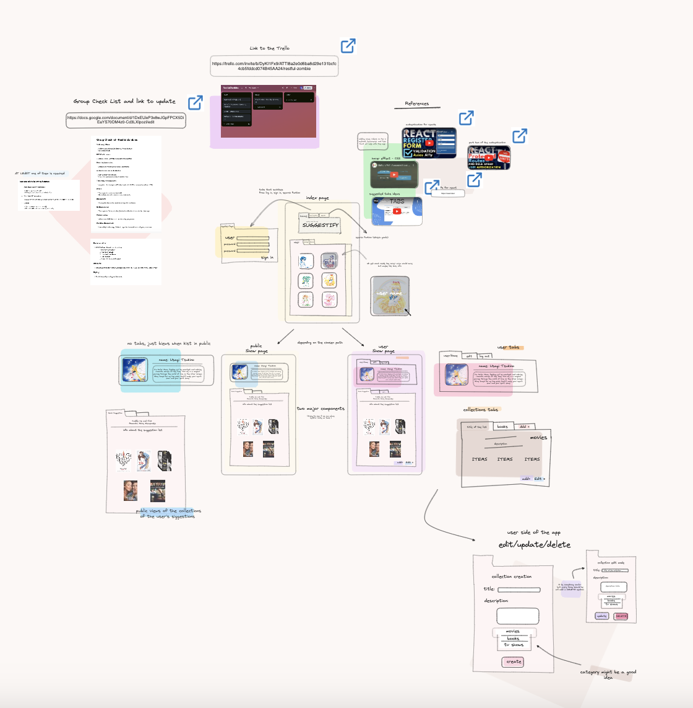

# Suggestify

Suggestify is a MERN stack social media application for users to share and explore their personal favorites and recommendations. Users can share favorites related to movies, tv shows, products, restaurants and books. They can view other favorites to explore new restaurants, products, and entertainment options.

### Technologies Used:

- Express.js
- Node.js
- Mongoose
- MongoDB
- React
- Bcrypt 
- Jsonwebtoken
- Axios

### User Stories:
- As a user, I want to create an account so that I can start recommending my favorite items.
- As a user, I want to log in and log out securely.
- As a user, I want to see a personalized feed of recommendations.
- As a user, I want to view recommendations from other users.
- As a user, I want to add new recommendations with details like title, type, and review/description.
- As a user, I want to view the details of a specific recommendation.
- As a user, I want to update or delete my recommendations.

### MVP: 
- Users can sign up/log in, with encrypted passwords and an authorization flow.
- Users can view their own recommendations.
- Users can view recommendations from other users.
- Create, read, update, and delete recommendations.
- UI styling for a user-friendly experience.

### Stretch Goals:
- Users can comment on recommendations.
- Add search and filter for recommendations.
- Pull from a third-party API to fetch media information.
- Implement notifications for new recommendations.
- Implement multi-factor authentication.

## The Vision:

### Approach Taken:

1. Began by modeling the database for User accounts, collections posted by the user, and recommendations listed within each collection. 
2. Started the backend to develop CRUD operations for User accounts, collections, and recommendations.
3. Established authentication for users to have their own user accounts to post collections and recommendations.
4. Developed frontend using React and established communication with the backend. 
5. Work through debugging and merge conflicts
6. CSS styling

### Future Additions to the Site:
- Add navigation buttons such as Back buttons for navigation flow between pages.
- Smoother navigation between buttons, tabs, and pages so that page refreshes when a user, collection or recommendation is added.

## Deployment:

- Application is deployed and can be viewed via:
Netlify (Frontend): https://playful-cactus-764ac1.netlify.app/

- Heroku (Backend): https://nameless-beach-23923-c2e8de3dcdd3.herokuapp.com/user

### Access code here: 
- Frontend: https://github.com/Hirostory/Suggestify-Frontend
- Backend: https://github.com/Hirostory/Suggestify-Backend

